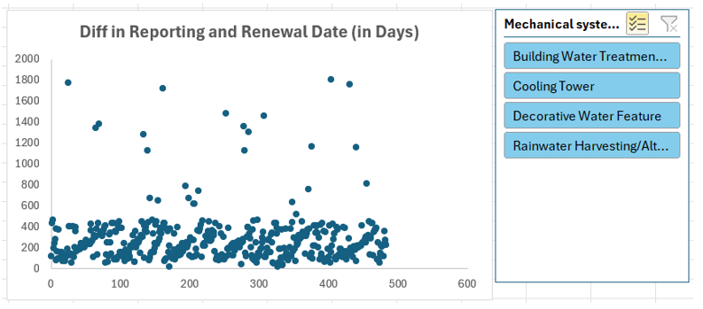

# Gagandeep Singh - Data Analyst Portfolio #

## About me
Hi there, I am Gagandeep Singh. I have several years of experience in the IT industry in the QA domain, and currently, I am pursuing an MBA from the University of Canada West, Vancouver, BC, Canada. Data analysis has remained part of my QA job while dealing with the large data dumps, aka legacy data when migrating them to the newly built system software. Moreover, I have officially learnt business and data analytics as part of several courses in my MBA journey, such as Quantitative Analysis, Business Analytics, and loud Computing. All this learning has enabled me to gain expertise in Excel, PowerBI, Tableau, AWS, and SQL for efficiently deploying data analytics techniques, viz., data mining, data wrangling, data governance, data analytics, dashboard building, report writing, etc.

This repository contains some projects from an array of projects I created on the AWS platform as part of my MBA - Cloud Computing course. I strive to do many more amazing projects in the field of data analytics in the future and expand my portfolio of projects.

I hope you will find the work showcased below informative and engaging, and I welcome any opportunity to discuss my qualifications further with you.

## Table of Contents
- [About Me](#about-me)
- [Projects Undertaken](#projects-undertaken)
  - [1. Descriptive Analysis](#1-descriptive-analysis)
  - [2. Exploratory Analysis](#2-exploratory-analysis)
  - [3. Data Wrangling](#3-data-wrangling)
  - [4. Data Quality and Privacy](#4-data-quality-and-privacy)
- [Certificates](#certificates)
- [Contact Information](#contact-information)

## Projects Undertaken

### 1. Descriptive Analysis

**Project Description**: Descriptive Analysis of “Issued operating permits – water systems”

**Project Title**: Understanding the Summary Statistics of Water Systems Operating Permits at the City of Vancouver

**Objective**: The core objective of this descriptive analysis is to answer some significant descriptive business questions for comprehensive insights and enable data-driven decision-making through the summarization of the key characteristics and trends. These insights will help the city increase operational efficiency and enhance public service delivery.
1. *How many systems in each category are currently Active vs. Inactive?*
2. *How many mechanical system owners are voluntarily participating in the Operating Permit program?*
3. *What is the current proportion of the four different types of mechanical systems?*
4. *What is the count of the permits renewed by month?*

**Dataset**: This dataset details permits issued for water systems, including permit types, renewal and reporting dates, and the systems they govern.
- *Operating permit number*: Unique permit number generated when the application is submitted.
- *Mechanical system type*: Lists four types: Cooling towers, Decorative water features, Building water treatment systems and Rainwater harvesting/non-potable.
- *Current system status*: Either Active or Inactive.
- *Permit renewal date*: The permit renewal date is the date by which an Operating Permit must be renewed.
- *Voluntary participant*: Y or N, where Y means that the owner of the mechanical system is not subject to the Operating Permit program but is voluntarily participating, and N means that the owner is legally required to participate in the Operating Permit program.
- *Turbidity*: The turbidity of the water sample as measured by an accredited laboratory in units of NTU (nephelometric turbidity units) and applicable only to rainwater harvesting water systems.
- *Temperature*: The temperature of the water sample, as measured by the operator, is in units of degrees Celsius and is applicable only to rainwater harvesting.

**Tools and Technologies**:
- Primarily, the AWS Glue and Glue DataBrew services were used to carry out descriptive analysis.
- The Open Data Portal of the City of Vancouver provides a built-in feature named Chart Builder. This has been used to create different visualizations.

**Methodology**:

1.	*Data Collection and Preparation*: As part of the data ingestion process, the dataset was exported in Excel format from the City of Vancouver – Open Data Portal and then uploaded to the raw S3 bucket on AWS. Further, the dataset was prepared for the descriptive analysis by profiling and cleaning it using the AWS Glue DataBrew.
2.	*Descriptive Statistics*: To find the answers to the descriptive questions given, ETL pipelines were designed using the AWS Glue service.
3.	*Data Visualization*: Different kinds of visual representations were also created to illustrate the findings produced by the ETL pipelines, such as:
- Bar chart for Current System Status by Mechanical System Type
- Normally stacked Bar chart for the Voluntary Participant count by Mechanical System Type
- Pie chart for the proportion of Mechanical System Types
- Treemap for the count of permits renewed by month

**Insights and Findings**:

The insights derived from the descriptive analysis of the given dataset were as follows:
1.	The Cooling Tower system has the highest number of active permits, followed by the Decorative Water Feature system. The rainwater harvesting system has the least active permits.
2.	The proportion of voluntary participation by the system owners is significantly less, merely a little over three percent.
3.	Most operating permits are applied by the owners of Cooling Tower water systems, which stands at 57% of the total.
4.	Nearly 30% of the permit holders are due to renew their operating permits in the first two months (January and February) of 2025.

### 2. Exploratory Analysis
**Project Description**: Exploratory Analysis of “Issued operating permits – water systems”

**Project Title**: Finding Patterns and Trends in the Operating Permits of Water Systems

**Objective**: The core objective of this exploratory analysis is to perform exploratory data analysis (EDA) on the selected dataset to uncover patterns, trends, and insights related to permit renewal. Through this EDA and by visualizing the correlation or pattern between a set of variables we aim to discover valuable and meaningful insights that eventually help the business/organization in data-driven decision-making. In particular, we find the answers to the below questions:
1. Comparison of the Average Turbidity and Average Temperature for the Rainwater Harvesting permits based on their renewal months.
2. Is there any significant difference in the duration (in days) between the Date of the most recent report and the Permit renewal date?

**Tools and Technologies**:
- Primarily, the AWS Glue and Glue DataBrew services were used to carry out descriptive analysis.
- The Open Data Portal of the City of Vancouver provides a built-in feature named Chart Builder. This has been used to create the column chart for the first EDA question.
- Excel has been used to draw a scatter plot for the second EDA question.

**Methodology**:
1.	*Data Collection and Preparation*: As part of the data ingestion process, the dataset was exported in Excel format from the City of Vancouver – Open Data Portal and then uploaded to the raw S3 bucket on AWS. Further, the dataset was prepared for the descriptive analysis by profiling and cleaning it using the AWS Glue DataBrew.
2.	*Exploratory Analysis*: To find the answers to the exploratory questions given, ETL pipelines were designed using the AWS Glue service.
3.	*Data Visualization*: Different kinds of visual representations were also created to illustrate the findings produced by the ETL pipelines, such as:
- Column Chart for Avg Turbidity vs Avg Temperature
- Scatter Plot for the difference in date of reporting and renewal

**Insights and Findings**:

1.	The average turbidity was proportional to the average temperature for the permits renewed in the spring season. However, the turbidity was much lower relative to the temperature from fall to winter.
2.	The difference between the date of reporting and renewal has remained under 2 years for 90% of the permits.

### 3. Data Wrangling

**Project Title**: Data Wrangling of “Issued operating permits – water systems”

**Objective**: The overarching aim of this project is to perform comprehensive data wrangling to prepare a robust dataset for descriptive and exploratory analytics for the Operating Permits – Water Systems dataset of the City of Vancouver made available to us by the Open Data Portal. By cleaning, transforming, and consolidating data from various sources, the project aims to enhance the accuracy and usability of water systems data for subsequent analysis and reporting.

**Tools and Technologies**: Primarily, the AWS Glue DataBrew service was used to carry out data wrangling wherein a recipe as a resource was used to document and publish the data cleaning and transformation steps.

**Methodology**:
1.	*Data Collection*: As part of the data ingestion process, the dataset was exported in Excel format from the City of Vancouver – Open Data Portal and then uploaded to the raw S3 bucket on AWS.
2.	*Data Profiling*: An initial assessment of the dataset was conducted to understand its structure and content, such as the number of rows and columns and (data) types of the columns. Issues such as missing values, duplicate values, invalid values, etc., were also examined during the profiling process.
3.	*Data Cleaning and transformation*: Through the data cleaning process, a high-quality dataset was obtained after performing functions like fixing or removing incorrect, corrupted, incorrectly formatted, duplicate, or incomplete data. In particular, the following functions were carried out.
- The whitespaces were replaced with underscores in all the field names.
- The format of the date columns was changed to “yyyy-mm-dd.”
- 3 new columns for the Permit Renewal Year, Quarter, and Month, respectively, were created from the Permit_Renewal_Date column using the dateTime function.
- Some columns, such as Escherichia coli, Geom, Geo Local Area, Water quality reports link, geo_point_2d, etc., were removed/deleted.
4.	*Storing the High-Quality Dataset*: The cleaned and transformed dataset was stored in two folders, System and User, in the transform bucket of AWS S3. The System folder holds the dataset in PARQUET format with SNAPPY compression, while the User folder contains the dataset in CSV format with no compression.

### 4. Data Quality and Privacy

**Project Title**: Data Quality Control Initiative for the City of Vancouver’s Datasets

**Project Description**: Implementation of Data Quality Control Measures for the City of Vancouver’s datasets

**Objective**: The primary objective of this project is to establish a comprehensive Data Quality Control (DQC) framework for the datasets provided by the Open Data Portal for the City of Vancouver. This framework will ensure the accuracy, completeness, consistency, and reliability of the organization's data, enhancing decision-making processes and overall business performance.

**Background**: As the City of Vancouver continues to expand its operations and data sources, issues related to data quality have surfaced, including inaccuracies, duplicate records, and inconsistent formats. Poor data quality can lead to misguided business strategies, inefficiencies, and regulatory compliance risks. This project aims to implement robust data quality control measures to mitigate these issues.
Scope: This project focused on the following key areas:
- Data Privacy: Masking Personal Identifiable Information (PII) in the entire dataset.
- Data Quality: Evaluating the completeness, uniqueness, and date freshness of the respective columns.

**Tools and Technologies**: The ETL pipeline resource mainly with two transform nodes, “Detect Sensitive Data” and “Evaluate Data Quality” on AWS Glue service is used

**Methodology**:

1.	_Data Privacy_: This is achieved by using the transform node named “Detect Sensitive Data” in the ETL pipeline on AWS Glue. As the dataset belongs to Canadian permit holders, seven types of sensitive data for Canada are added to the privacy rule to mask it.
2.	_Data Quality_: This is achieved by using the transform node named “Evaluate Data Quality” in the ETL pipeline on AWS Glue. The uniqueness rule is added for the primary key column to ensure that it never violates the primary key constraint. The completeness rule is configured for many other columns, which must never have a null value. Date Freshness is used to filter the dataset where the reporting date is within 3 years.

**Deliverables**:
1.	A comprehensive Data Quality Control ETL pipeline with privacy and quality nodes configured.
2.	Cleaned and validated datasets ready for analysis and reporting.

## Certificates
- [BADGE - AWS Academy Graduate - AWS Academy Cloud Foundations](https://www.credly.com/go/MIRV54Tu) (AWS Academy)

## Contact Information
- **LinkedIn**: [@gagandeepsingh247](https://www.linkedin.com/in/gagandeepsingh247/)
- **Email**: singh.gagandeepgs@gmail.com
- **UCW Student ID**: 2318246

_**Thank you for your time, I look forward to hearing from you soon.**_
